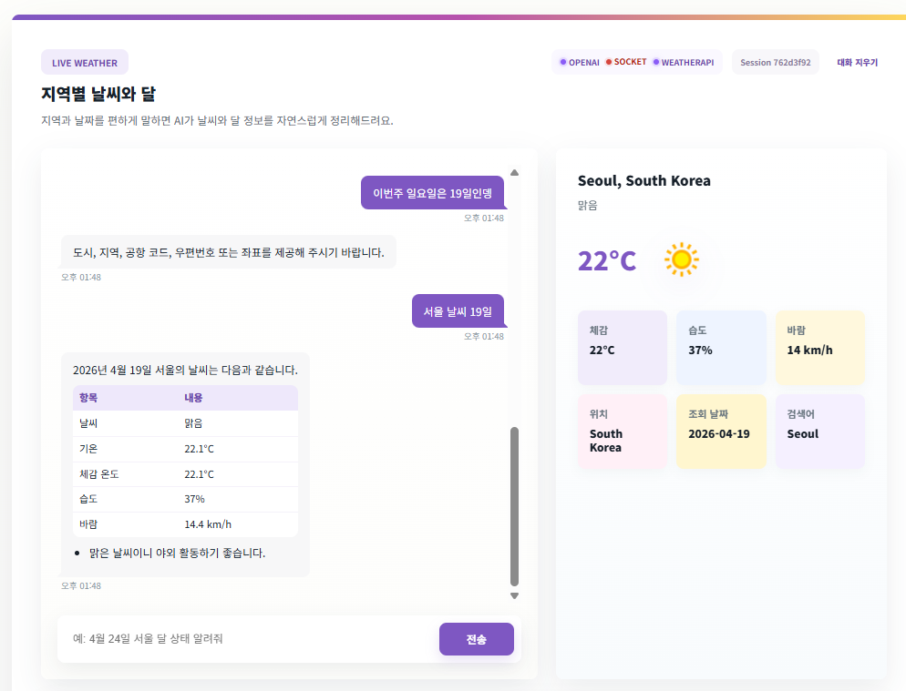
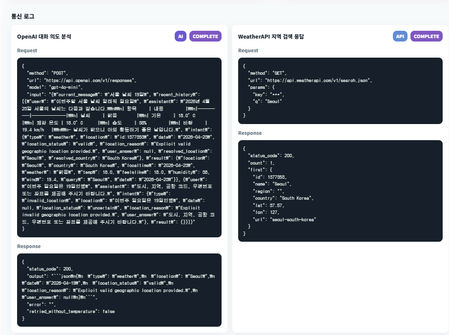

# AI 날씨와 달

OpenAI, WeatherAPI, FastAPI WebSocket, MCP 서버를 사용한 대화형 날씨/달 정보 조회 앱입니다.

사용자는 브라우저 채팅창에 자연어로 질문합니다. 예를 들어 `내일 서울 날씨 알려줘`, `4월 24일 부산 달 모양 알려줘`처럼 입력하면 OpenAI가 의도와 장소, 날짜를 분석하고 WeatherAPI 데이터를 바탕으로 한국어 답변을 생성합니다.

## Screenshots





## Features

- 자연어 기반 날씨/달 정보 조회
- OpenAI를 이용한 장소 검증, 날짜/의도 분석, 한국어 답변 생성
- WeatherAPI 기반 현재 날씨, 날짜별 날씨, 천문 정보 조회
- MCP tool 서버를 통한 `get_weather`, `get_astronomy` 분리
- WebSocket 기반 스트리밍 답변
- 세션 UUID 기반 대화 히스토리 유지
- Markdown 표/목록 렌더링
- 통신 로그 표시

## Project Structure

```text
weather/
├── frontend/
│   ├── index.html
│   ├── styles.css
│   └── app.js
├── backend/
│   ├── __init__.py
│   ├── host_app.py
│   ├── main_weather.py
│   └── client_gateway.py
├── mcp_server/
│   ├── __init__.py
│   └── weather_mcp_server.py
├── public/
│   ├── weather_mcp_1.png
│   └── weather_mcp_2.png
├── requirements.txt
├── .env.example
├── .gitignore
└── README.md
```

## MCP 개념

MCP(Model Context Protocol)는 AI 앱이 외부 기능을 tool 형태로 호출할 수 있게 해주는 연결 규격입니다.

이 프로젝트에서는 날씨/천문 조회 기능을 MCP 서버로 분리했습니다.

```text
Browser
  ↓ WebSocket
Host App, FastAPI
  ↓ MCP tool call
MCP Server
  ↓ HTTP API
WeatherAPI
```

각 구성요소의 역할은 다음과 같습니다.

| 구성요소 | 역할 |
|---|---|
| `frontend/` | 채팅 UI, WebSocket 연결, Markdown 렌더링 |
| `backend/host_app.py` | Host 앱, 정적 파일 제공, WebSocket endpoint, MCP client |
| `backend/main_weather.py` | OpenAI 호출, WeatherAPI 호출, 의도 분석, 답변 생성 |
| `mcp_server/weather_mcp_server.py` | MCP tool 서버, `get_weather`, `get_astronomy` 제공 |
| WeatherAPI | 실제 날씨/천문 데이터 제공 |
| OpenAI | 자연어 이해와 한국어 답변 생성 |

MCP 서버를 분리하면 나중에 날씨 외에도 일정, 파일 검색, DB 조회 같은 tool을 같은 방식으로 붙이기 쉽습니다. 대신 실행해야 할 프로세스가 늘어나므로 작은 앱에서는 구조가 조금 복잡해질 수 있습니다.

## Quickstart

### 1. 환경 준비

Python 3.11 이상을 권장합니다.

```bash
cd ~/weather
python3 -m venv .venv
source .venv/bin/activate
pip install -r requirements.txt
```

설치되는 주요 패키지:

| 패키지 | 용도 |
|---|---|
| `fastapi` | Host 앱과 WebSocket API |
| `uvicorn[standard]` | FastAPI 실행 서버, WebSocket 지원 |
| `requests` | OpenAI, WeatherAPI HTTP 요청 |
| `mcp` | MCP 서버 구현 |
| `langchain-mcp-adapters` | Host 앱에서 MCP tool 호출 |

### 2. 환경변수 설정

```bash
cp .env.example .env
```

`.env`에 아래 값을 넣습니다.

```env
OPENAI_API_KEY=your_openai_api_key_here
OPENAI_MODEL=gpt-4o-mini
WEATHER_API_KEY=your_weatherapi_key_here
```

선택 설정:

```env
MCP_URL=http://127.0.0.1:9000/mcp
MCP_HOST=0.0.0.0
MCP_PORT=9000
MCP_TRANSPORT=streamable-http
```

`.env`를 수정했다면 Host 앱을 재시작해야 합니다.

### 3. 실행

터미널 1: MCP 서버

```bash
cd ~/weather
source .venv/bin/activate
python -m mcp_server.weather_mcp_server
```

터미널 2: Host 앱

```bash
cd ~/weather
source .venv/bin/activate
uvicorn backend.host_app:app --reload --host 0.0.0.0 --port 8000
```

터미널 3: 정적 HTML 서버

```bash
cd ~/weather/frontend
python3 -m http.server 5500 --bind 0.0.0.0
```

브라우저:

```text
http://127.0.0.1:5500/index.html
```

Host 앱만으로도 접속할 수 있습니다.

```text
http://127.0.0.1:8000
```

## 실행 흐름

```text
1. 사용자가 frontend에서 질문 입력
2. frontend/app.js가 WebSocket /ws로 메시지 전송
3. backend/main_weather.py가 OpenAI로 의도, 장소, 날짜 분석
4. Host 앱이 MCP 서버의 get_weather 또는 get_astronomy 호출
5. MCP 서버가 WeatherAPI를 호출
6. backend/main_weather.py가 API 결과를 정리
7. OpenAI가 한국어 답변 생성
8. WebSocket으로 답변 chunk 스트리밍
9. frontend가 채팅 버블, 오른쪽 정보 패널, 통신 로그 렌더링
```

의도별 처리:

```text
날씨 질문 → get_weather
달/해 질문 → get_astronomy
가벼운 대화 → WeatherAPI 호출 없이 OpenAI 답변
장소가 애매한 질문 → 사용자에게 장소 재설정 요청
```

## API

| Method | Path | 설명 |
|---|---|---|
| `GET` | `/` | 프론트엔드 HTML 반환 |
| `GET` | `/status` | OpenAI, WeatherAPI 연결 상태 확인 |
| `GET` | `/weather?location=Seoul&date=2026-04-24` | 날씨 조회 |
| `GET` | `/astronomy?location=Seoul&date=2026-04-24` | 달/해 정보 조회 |
| `WS` | `/ws` | 채팅 WebSocket |

## WebSocket 메시지

브라우저에서 보내는 메시지:

```json
{
  "type": "chat",
  "message": "4월 24일 서울 달 모양 알려줘"
}
```

서버 이벤트:

| type | 설명 |
|---|---|
| `session` | WebSocket 연결 시 세션 UUID 전달 |
| `chat_start` | 의도 분석과 API 조회 결과 전달 |
| `chat_delta` | OpenAI 답변 chunk |
| `chat_done` | 최종 답변과 통신 로그 |
| `clear_history` | 대화 기록 초기화 |

## 답변 정책

- 항상 한국어로 답변합니다.
- 사용자의 현재 질문을 히스토리보다 우선합니다.
- 날씨/천문 정보는 API 결과만 사용합니다.
- 장소가 실제 조회 가능한 지역인지 먼저 검증합니다.
- 날씨 정보는 표 형태를 우선 사용합니다.
- 달 정보는 뜸/짐 상태 판단보다 달 위상과 모양 설명 중심으로 답변합니다.
- 이미지 URL, API 필드명, 내부 로그는 답변에 노출하지 않습니다.

## Troubleshooting

### OpenAI 키를 바꿨는데 이전 키로 요청되는 경우

Host 앱을 재시작합니다.

```bash
Ctrl+C
uvicorn backend.host_app:app --reload --host 0.0.0.0 --port 8000
```

### `No module named 'mcp'`

가상환경을 활성화하고 패키지를 설치합니다.

```bash
source .venv/bin/activate
pip install -r requirements.txt
```

### WebSocket 경고가 나는 경우

`uvicorn[standard]`가 설치되어 있는지 확인합니다.

```bash
pip install "uvicorn[standard]"
```

### `styles.css`, `app.js`가 404인 경우

정적 서버를 `frontend/` 디렉토리에서 실행합니다.

```bash
cd ~/weather/frontend
python3 -m http.server 5500 --bind 0.0.0.0
```
